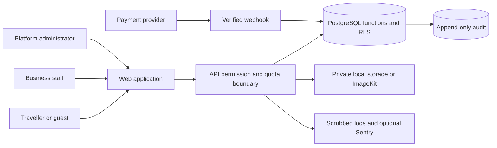

# Pre-pilot threat model — MSHWAR-114

Review scope: Epic 13 on Epics 1–12, migration `022_security_privacy.sql`. This is a code review artifact, not an independent penetration-test certificate. The pilot uses test payments and deterministic AI unless a separately reviewed provider is enabled.

## Assets and boundaries

Protect account credentials and sessions, travellers’ preferences and trips, guest capabilities, organisation documents and contacts, booking/payment state, operational audit records, and provider budgets. The browser and all request headers, IDs, filenames, bodies and uploaded bytes are untrusted. FastAPI verifies the cookie session; PostgreSQL functions enforce membership and capabilities. Runtime database credentials belong to `mshwar_backend`; migration-owner credentials must never be deployed to the API. Provider webhooks and signed download/share links cross separate capability boundaries. A valid download link is a bearer capability for at most 300 seconds.

## Abuse cases and controls

| Actor/surface | Threat and impact | Controls and evidence | Residual condition |
| --- | --- | --- | --- |
| Anonymous traveller | Password/reset enumeration, brute force, resource exhaustion | Endpoint/IP quotas, reset’s existing uniform response, hashed quota keys; `test_security_unit.py` | Ingress must enforce body/concurrency/time limits; account registration retains existing duplicate-email response |
| Signed-in traveller | Swap booking, trip, planner or organisation IDs to read/alter another user’s data | Default session dependency; verified user GUC; SQL object checks; foreign/missing IDs return identical 404; `test_security_integration.py` | Public catalogue records remain intentionally discoverable |
| Guest/share recipient | Use an expired, revoked or weaker link to edit/vote/share | Existing Epic 12 hashed capabilities, role checks and expiry; closed endpoint allowlist; group regression tests | Recipients can share a live bearer link; owner can revoke it |
| Business staff | Escalate inventory staff to finance/team, cross tenant documents or booking actions | Active membership + capability checks in portal/DB before storage; RBAC and IDOR tests | Trusted platform admin has separately gated operational access |
| Business uploader | Disguise HTML/SVG as an image, write traversal paths, exhaust storage, expose documents | MIME and byte signatures, bounded bytes, private storage, per-org count/day bytes, random keys, attachment download, HMAC URL <=300s | Signature checks are not antivirus/CDR; see findings and pilot restrictions |
| Platform admin | Audit tampering, accidental disclosure through search, privileged action without attribution | No app edit/delete/truncate, trigger allowlist, actor/action/target/reason/time, scrubbed read-only search UI; database privilege tests | Database owner can change schema; restrict and monitor migration/backup credentials separately |
| Attacker in another origin | Cookie-authenticated CSRF or forged identity headers | Unsafe Origin checks, SameSite cookies, ignored identity/proxy headers, explicit CORS origins; integration test | TLS/host and trusted ingress configuration remain deployment responsibilities |
| Payment attacker | Simulate someone else’s payment; forge/replay a provider event | Booking ownership before simulation, existing provider signatures/idempotency/state machine, audit triggers | Simulation is test-mode functionality; no production Lebanon acquirer is implied |
| AI budget abuser | Concurrent requests, failed requests or restarts bypass daily spend cap | Atomic PostgreSQL reservation in an independent committed transaction; per-user UTC day budget; concurrency tests | Paid adapter must price a provable maximum including token/retry bounds before enablement |
| Log reader/provider | Secrets, payment references or private input captured in telemetry | Field registry, recursive/string scrubber, hidden SQL parameters, scrubbed Sentry beforeSend/breadcrumbs, opaque request IDs | Do not log arbitrary unlabelled user content; infrastructure logs require equivalent filtering |
| Supply-chain attacker | Vulnerable dependency or runtime container | Frozen JS lock, resolved Python dependency scan, API/web image scans, SHA-pinned Trivy, criticals fail CI | Weekly scans detect later advisories; no scan proves absence of vulnerabilities |

## Trust assumptions

- TLS terminates at a controlled ingress. The API container ignores forwarded headers by default. Configure one trusted proxy path explicitly before relying on per-client IP quotas behind a proxy; never trust an arbitrary `X-Forwarded-For` header.
- Production sets `SECURITY_RATE_BACKEND=postgres`; the settings validator rejects memory limits in production. The memory implementation is only a single-process development substitute.
- Cookie and signing secrets are server-only. Database/network outages fail requests rather than silently disabling durable limits.
- Optional analytics is disabled until explicit cookie consent. Account marketing and personalisation are distinct, revocable purposes. Existing trip inputs supplied for a requested plan are still used to fulfil that request.
- Signed links must be removed from reverse-proxy/access analytics just as in app logs. Verification downloads use `Content-Disposition: attachment`, `nosniff`, and `no-store`.

References: [OWASP authorization guidance](https://cheatsheetseries.owasp.org/cheatsheets/Authorization_Cheat_Sheet.html), [OWASP file upload guidance](https://cheatsheetseries.owasp.org/cheatsheets/File_Upload_Cheat_Sheet.html), [ImageKit private images](https://imagekit.io/docs/private-images), [ImageKit signed URLs](https://imagekit.io/docs/signed-urls).
